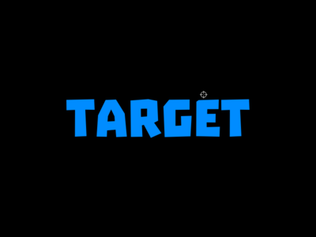
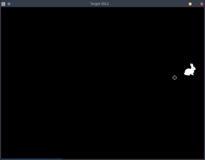

# Target SDL2

Target is a simple 2D game where you must shoot a target as quickly as possible to get high points. 
A target appears in random place and with random latency so you can't predict where and when it'll
spawn next time. 

After each successful shot, points and time for this shot are drawn.
After each 10 shots you'll see sum of points for those shots.

*Target* is based on SDL2 and Cairo. It uses the *Troika* font, that you have to [download](http://www.dafont.com/troika.font) and install by yourself.

## Poor rabbit

You can run the game with `no_rabbit_please` argument if you can't watch a rabbit gets shot. Then instead of the rabbit 
a round target made of concentric circles will be used. 

    ./target no_rabbit_please

## Credits

- [Original program based on SDL 1.2](https://github.com/bb-q/target)
- [Troika font](http://www.dafont.com/troika.font)
