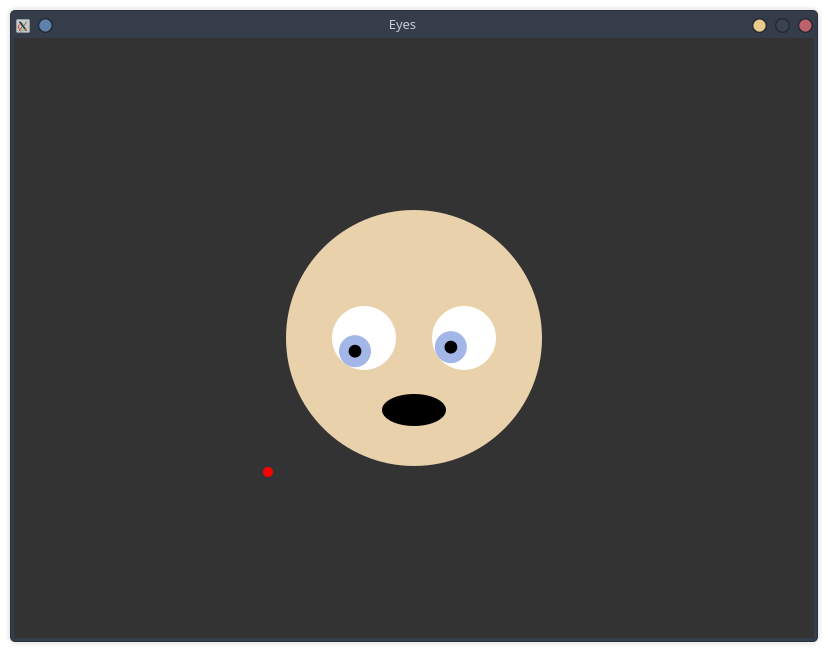

# Eyes

Animiertes Gesicht, dessen Augen dem Mauszeiger folgen. Adaptiert von einer [LÖVE-Animation][1].



## Erstellen

```bash
cd demo
make demo CAIRO=1
```

## Erstellen die SDL2-Version

Um diese Version zu erstellen, müssen Sie [SDL2-Units][2] herunterladen und den Wert der Variable *SDL2_UNITS* im Makefile anpassen.

```bash
cd demo-sdl
make demo CAIRO=1
```

## Starten das Originalprogramm

```bash
cd original
love .
```

[1]: https://love2d.org/forums/viewtopic.php?p=220421#p220421
[2]: https://github.com/PascalGameDevelopment/SDL2-for-Pascal
